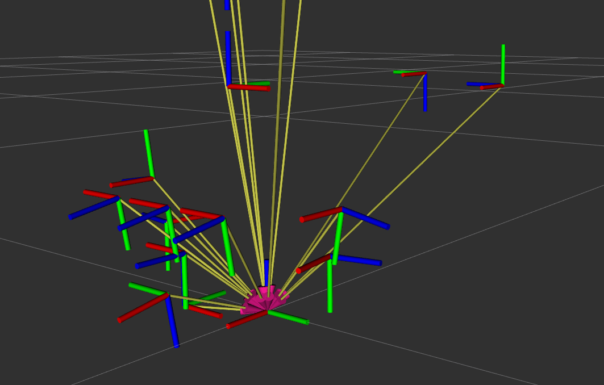

# TransformGraph Library

## Overview

The `TransformGraph` library provides a convenient interface for managing and querying a graph of coordinate frame transformations using the NetworkX library.

## Features

- **Graph Construction from TF Listener:** Create a transformation graph directly from a ROS TF listener.
- **Graph Construction from JSON File:** Load a transformation graph from a JSON file -- ideally serialised from a previous run of this library.
- **Serialization:** Save the transformation graph to a JSON file.
- **Transformation Lookup:** Find the transformation matrix between any two frames in the graph.

## Usage
1. Constructing the Graph from a TF Listener

Setup a tf listener and construct an instance of TransformGraph using it
``` python
import rospy
import tf
from transform_graph import TransformGraph

rospy.init_node('tf_listener')
listener = tf.TransformListener()
# Create TransformGraph from TF listener
tf_graph = TransformGraph.from_tf_listener(listener)
```

2. Serialising into JSON
``` python
output_file = 'path/to/output/graph.json'
tf_graph.serialise(output_file)
```
3. Deserialising a previously recorded TF
``` python
json_path = 'path/to/your/graph.json'
tf_graph = TransformGraph.from_json_file(json_path)
```
4. Querying all transforms with respect to a particular root node
``` python
target_frame = "box_base"
print(f"Target frame is: {target_frame}")
for node in tg.nodes:
    print(f"source: {node}:\n{tg.find_T_target_source(source=node, target=target_frame)}")
    print()
```

5. Publishing a serialised transform graph as TF rooted at a given frame id
``` python
import rospy

from static_transform_graph_publisher import StaticTFPublisher
from transform_graph import TransformGraph

rospy.init_node('tf_publisher')
tg = TransformGraph.from_json_file("test.json")
root_frame = "box_base"
try:
    StaticTFPublisher.publish_transform_graph(tg, root_frame=root_frame)
    rospy.spin()
except rospy.ROSInterruptException:
    pass
```
As seen in the image below, the new TF tree has all links pointed at a single 
`base_box`

The calibration graph structure should be fully connected, so we can generate any
structure of a valid TF tree we like
